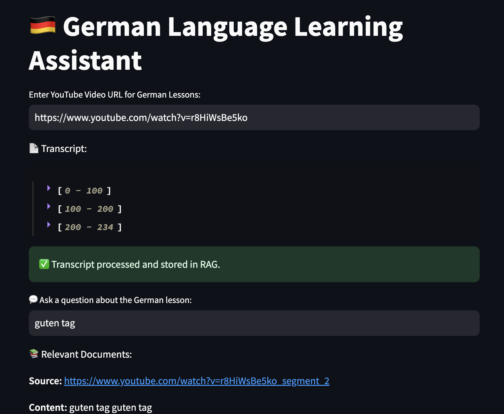
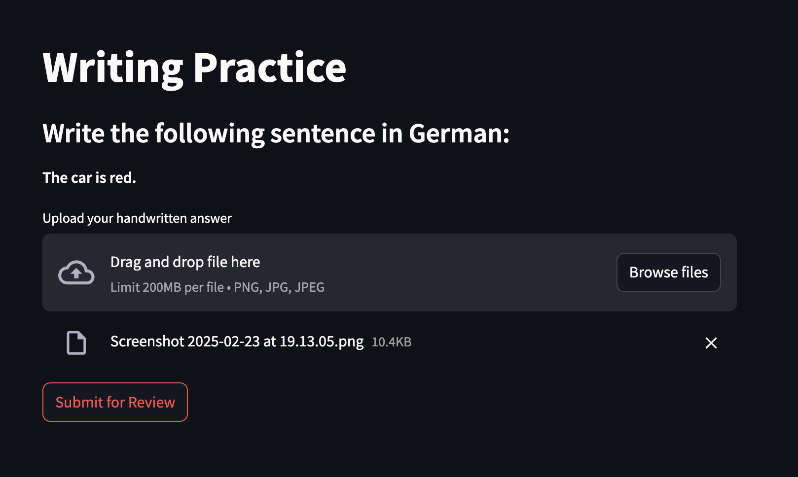

<h1 align="center">genAI Bootcamp 2025</h1>


## Introduction

This project uses AI to assist A1-level German learners by guiding sentence construction through hints, vocabulary, and structured feedback—without direct translations.

## Table of Contents

- [Introduction](#introduction)
- [Table of Contents](#table-of-contents)
- [Business](#business)
- [Backend](#backend)
  - [YouTube Transcript Retrieval](#youtube-transcript-retrieval)
  - [RAG Integration](#rag-integration)
- [Frontend](#frontend)
- [Opea](#opea-open-process-execution-agent)
- [Vocab Importer](#vocab-importer)
- [Writing Practice](#writing-practice)
- [Song Vocab](#song-vocab)
- [Response result](#response-result)
- [Programming Languages](#programming-languages)
- [Applications, Plugins & Tools Used](#applications--plugins---tools-used)
- [Sentence Constructor AI Model Readme Files](#sentence-constructor-ai-model-readme-files)
- [Problems](#problems)
  - [Meta AI](#meta-ai)
  - [Frontend Integration with Backend](#frontend-integration-with-backend)
  - [Mega Service](#mega-service)
- [Acknowledgments](#acknowledgments)
- [Installation](#installation)
- [Usage](#usage)
- [Contributing](#contributing)
- [Technical Specifications](#technical-specifications)
- [Environment Setup](#environment-setup)
- [Docker Usage](#docker-usage)
- [Database Information](#database-information)
- [Module-Specific Details](#module-specific-details)

[Generate TOC](https://ecotrust-canada.github.io/markdown-toc/)

<br>

## Business

The platform enhances language learning with personalized, AI-driven study activities, supporting real-time interactions and adaptive feedback. It must accommodate 100 active students in Berlin while ensuring data privacy and cost-effective infrastructure. A dedicated AI PC (€4,000–€7,000 budget) is planned to optimize performance.

Your role as an AI Engineer involves:

- Developing AI-driven learning applications.
- Maintaining and improving the learning portal.
- Expanding language support while balancing scalability and privacy.

## Backend

The backend is developed using Flask and serves as the core API for the platform. It handles study sessions, vocabulary management, and user interactions.

### Key Features:

- **Framework:** Flask with SQLAlchemy ORM.
- **Database:** SQLite for managing vocabulary and study session data.

### Technologies:

- **Flask-SQLAlchemy:** ORM for database interactions.
- **Flask-CORS:** Enables cross-origin requests from the frontend.
- **Unit Testing:** PyTest for API and database tests.

### YouTube Transcript Retrieval

The platform integrates YouTube transcript retrieval using the YouTubeTranscriptApi. This feature allows students to input a YouTube URL and retrieve the German transcript for language learning.



- Library: [YouTubeTranscriptApi](https://pypi.org/project/youtube-transcript-api/)
- Features:
  - Extracts transcripts from YouTube videos.
  - Supports German transcripts (`'de'` language code).
  - Parses transcripts into segments for further processing.

### RAG Integration

The platform uses Retrieval-Augmented Generation (RAG) to enhance language learning by retrieving relevant content from stored documents and using it as context for AI-generated responses.

- Vector Database: [ChromaDB](https://docs.trychroma.com/)
- Key Features:
  - Stores and indexes YouTube transcripts.
  - Queries the vector database to find relevant content.
  - Uses DialoGPT for context-aware response generation.

### Audio

The platform integrates text-to-speech (TTS) capabilities, allowing students to listen the questions and answers.


#### Features
- **Text-to-Speech (TTS):** Uses `gTTS` (Google Text-to-Speech) to generate spoken versions of AI-generated questions and answers.
- **Automatic Question Generation:** The system formulates a relevant question from the provided transcript or user query.
- **Audio Playback in UI:** The generated question and answer are available as **clickable audio players**.
- **Language Support:** Ensures proper **German pronunciation** by specifying the `'de'` language parameter.

#### **🔹 Libraries Used**
- [gTTS (Google Text-to-Speech)](https://pypi.org/project/gTTS/)
- [Streamlit Audio Player](https://docs.streamlit.io/)

#### How It Works
1. Question:
   - The AI extracts a relevant question from the user input and generates the answer.
  
2. Text-to-Speech Conversion:
   - `gTTS` converts the question and AI-generated answer into spoken audio.
   - The audio is saved as a temporary file.

3. Playback in UI:
   - Students can listen to both the question and the answer using embedded audio players in the Streamlit app.

## Frontend

The frontend is built using React and connects directly to the backend APIs. It offers an intuitive interface where students interact with AI-driven exercises.

### Key Features:

- Real-time sentence construction guidance.
- Vocabulary tables with hints and structured sentence feedback.
- Interactive study sessions with progress tracking.

### Technologies:

- **React.js:** Core library for building the UI.
- **Axios:** For API requests to the Flask backend.
- **Styled-Components:** For styling React components.

## Opea (Open Process Execution Agent)

The OPEA module handles complex chat interaction workflows. It was improved with debugging and LLM health checks and the streaming feature was added.

### Key Features:

- **OpenTelemetry Integration:** Exports logs and traces for better observability and it setup with docker.

## Vocab Importer

The Vocab Importer is built with Streamlit and allows educators to upload and manage vocabulary lists.


### Features:

- Supports JSON uploads of vocabulary lists.
- Exports student-specific vocabulary for offline practice.
- Displays word lists.

## Writing Practice




### Features
- **Word Group Generation**: Fetches basic German vocabulary groups from the **Ollama API**.
- **Sentence Construction**: Generates simple English sentences containing a selected German word.
- **Handwriting Recognition**: Uses `pytesseract` to transcribe student-written responses.
- **Automated Grading**: Evaluates student responses based on correctness, grammar, and structure.
- **Study Session Storage**: Saves graded sessions to a local SQLite database for review (feature under development).

### Technologies

- **Backend:** Flask (`pytesseract`, `requests`, `sqlite3`)
- **Frontend:** Streamlit
- **AI Model:** Llama2 via **Ollama API**
- **Database:** SQLite (`study_sessions.db`)

## Song Vocab

The Song Vocab API is a FastAPI-based service that retrieves song lyrics from the internet, extracts vocabulary words, and stores them in a structured SQLite database.

## Features
- **Retrieves song lyrics** from the web.
- **Extracts key vocabulary words** from lyrics.
- **Stores structured vocabulary** with definitions and examples.
- **Provides API access** for vocabulary retrieval and further analysis.

## Response result

[{'title': '99 Luftballons', 'url': 'https://westmusiker.de/wp-content/uploads/2020/08/Liedtext.pdf', 'snippet': '99 Luftballons. Nena. Hast Du etwas Zeit für mich. Dann singe ich ein Lied fuer Dich. Von 99 Luftballons. Auf ihrem Weg zum Horizont. Denkst Du vielleicht grad ...'}, {'title': '99 Luftballons Songtext von Nena', 'url': 'https://www.songtexte.com/songtext/nena/99-luftballons-63dcfa57.html', 'snippet': 'Hast du etwas Zeit für mich? Dann singe ich ein Lied für dich. Von neunundneunzig Luftballons Auf ihrem Weg zum Horizont Denkst du vielleicht grad an mich?'}, {'title': 'Nena – 99 Luftballons Lyrics', 'url': 'https://genius.com/Nena-99-luftballons-lyrics', 'snippet': '[Songtext zu „99 Luftballons“] [Strophe 1] Hast du etwas Zeit für mich? Dann singe ich ein Lied für dich. Von 99 Luftballons Auf ihrem Weg zum Horizont'}, {'title': 'NENA: 99 LUFTBALLONS', 'url': 'https://www.zebis.ch/sites/default/files/teaching_material/nena_99_luftballons.pdf', 'snippet': "Hast Du etwas Zeit für mich dann singe ich ein Lied für dich von 99 Luftballons auf ihrem Weg zum Horizont. Denkst Du vielleicht grad' an mich."}]

### Programming Languages

- [XML](https://en.wikipedia.org/wiki/XML)
- [Python](https://www.python.org/)
- [JavaScript](https://de.wikipedia.org/wiki/JavaScript)
- [React](https://react.dev/)
- [TypeScript](https://www.typescriptlang.org/)

### Applications, Plugins & Tools Used

- **[GitHub](https://github.com/):** Essential for repository hosting, enabling code sharing, and project management.
- **[TinyPNG](https://tinypng.com/):** Used for compressing images and reducing file sizes without substantial quality loss.
- **[Gemini](https://gemini.google.com/):** Used for AI-powered language translation and sentence construction guidance, helping students learn German through structured vocabulary hints and contextual feedback.
- **[ChatGPT](https://chat.openai.com/):** Assisted in generating language learning exercises, evaluating sentence structures, and providing real-time grammar feedback for learners.
- **[Claude](https://claude.ai/):** Contributed to advanced text processing and interactive language learning, helping refine vocabulary usage and sentence formation.
- **[Windsurf](https://codeium.com/windsurf):** Used for backend deployment with Python Flask, enabling AI-driven interactions and ensuring seamless integration with language learning tools.
- **[Lovable](https://lovable.dev/):** Used for frontend development.
- **[Groq](https://groq.com/):** Provides accelerated AI inference for large language models.

## Sentence Constructor AI Model Readme Files

- [ChatGPT Readme](https://github.com/DavidTausend/gen-ai-bootcamp-2025/blob/main/sentence-constructor/chartgpt/readme.md)
- [Claude Readme](https://github.com/DavidTausend/gen-ai-bootcamp-2025/blob/main/sentence-constructor/claude/readme.md)
- [Gemini Readme](https://github.com/DavidTausend/gen-ai-bootcamp-2025/blob/main/sentence-constructor/gemini/readme.md)

## Problems

### Meta AI

I didn't use Meta AI for the project because it isn't launched yet in German, and there are delays due to data security laws within the EU.

### Frontend Integration with Backend

There are a couple of problems between the frontend and backend API integration that need to be corrected in the near future, including inconsistent API responses and CORS configuration issues.

#### Resolved

I took the example of andrew code and converted it to work for the german language website.

### Mega Service

The Mega Service encountered issues related to API payload formatting, which led to 400 Bad Request errors. These were resolved by adjusting the JSON payload structure and improving error handling.

### Lenguage assistant Audio

I attempted to implement audio for the language assistant, but I was unable to make it work, so the feature was rolled back. My implementation may have been incorrect because I tried to download the audio from YouTube instead of having the LLM read the text.

[Mega Service solution](/Users/davidtausend/Documents/lang-portal/genAI/gen-ai-bootcamp-2025/opea-comps/mega-service/Readme.md)


### TTS Service Issue

The TTS (Text-to-Speech) Service faced several issues during deployment and integration:

#### Dependency Compatibility Issues
   - Some required Python packages (e.g., `lz4`, `vhacdx`, `mapbox_earcut`) failed to build correctly on macOS with the arm64 architecture.
   - The GCC compiler was not correctly linked, causing CMake-related errors.

#### Docker Build Errors
   - The `Dockerfile` was missing or incorrectly referenced, leading to build failures.
   - The TTS service failed to install dependencies due to timeout issues and missing pre-built wheels for `arm64`.

#### Audio Processing Challenges
   - The generated speech files had inconsistent playback quality and long latency.
   - The service was not properly handling text normalization, resulting in unnatural-sounding speech output.

## Acknowledgments

- My Mentor, **Andrew Brown** — I want to thank him for his guidance and support throughout this journey, helping me deepen my understanding of GenAI.

## Installation

To set up the project locally, follow these steps:

1. Clone the repository:
   ```bash
   git clone https://github.com/DavidTausend/gen-ai-bootcamp-2025.git
   ```

2. Navigate to the project directory:
   ```bash
   cd gen-ai-bootcamp-2025
   ```

3. Install the required dependencies for both backend and frontend:
   ```bash
   # Backend
   cd lang-portal/backend-flask
   pip install -r requirements.txt

   # Frontend
   cd ../frontend-react
   npm install
   ```

## Usage

To run the project, follow these steps:

1. Start the backend server:
   ```bash
   cd lang-portal/backend-flask
   flask run
   ```

2. Start the frontend application:
   ```bash
   cd ../frontend-react
   npm start
   ```

Access the application via `http://localhost:3000`.

## Contributing

We welcome contributions! Please follow these steps:

1. Fork the repository.
2. Create a new branch for your feature or bugfix.
3. Commit your changes and push to your fork.
4. Submit a pull request with a detailed description of your changes.

## Technical Specifications

For detailed technical insights, refer to the technical specification documents available in various modules:
- [Backend Technical Specs](lang-portal/Backend-Technical-Specs.md)
- [Frontend Technical Specs](lang-portal/Frontend-Technical-Specs.md)
- [Song Vocab Tech Specs](song-vocab/Tech-specs.md)
- [Writing Practice Tech Specs](writing-practice/Tech-specs.md)

## Environment Setup

Ensure you have the necessary environment variables set up. Refer to the `.env` files in the respective directories for guidance on required configurations.

## Docker Usage

The project supports Docker for easy setup and deployment. Use the `docker-compose.yml` file located in the `opea-comps` directory to start the services:

```bash
docker-compose up --build
```

## Database Information

The project uses SQLite databases to store data. Key databases include:
- `german_lessons.db` in `lenguage_learning_assistant`
- `study_sessions.db` in `writing-practice`

Ensure these databases are properly configured and accessible for the application to function correctly.

## Module-Specific Details

Each module may have its own specific details and documentation. Refer to the README or Tech-specs files within each module for more information.
