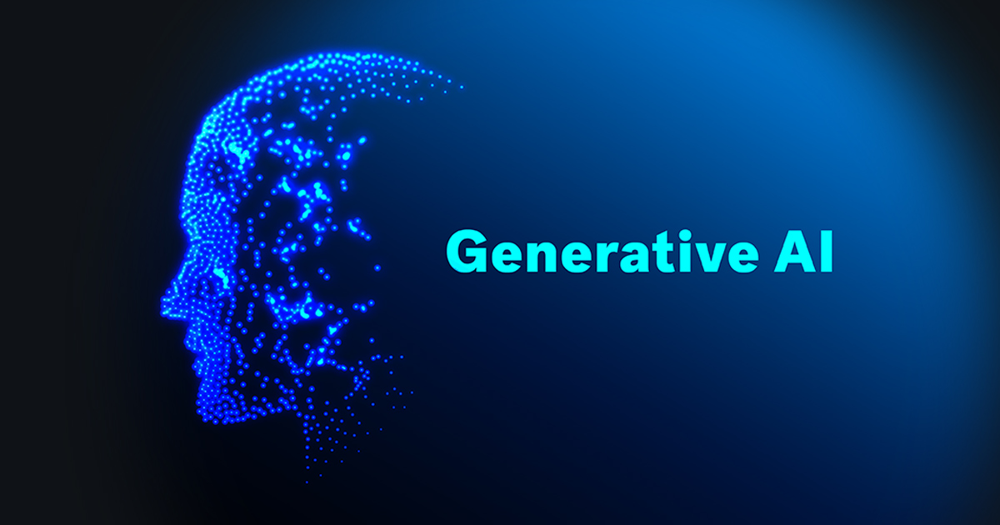
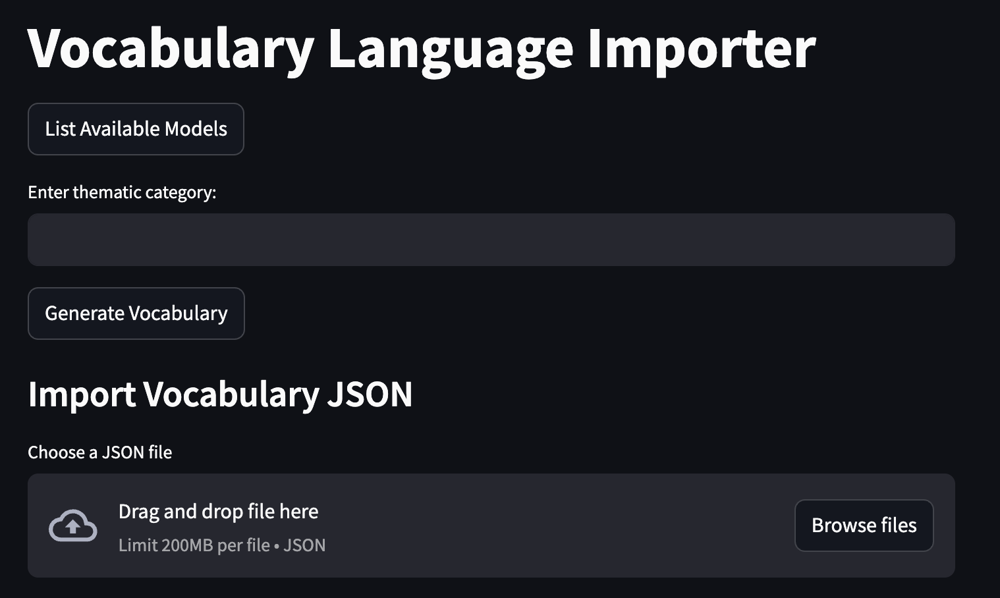
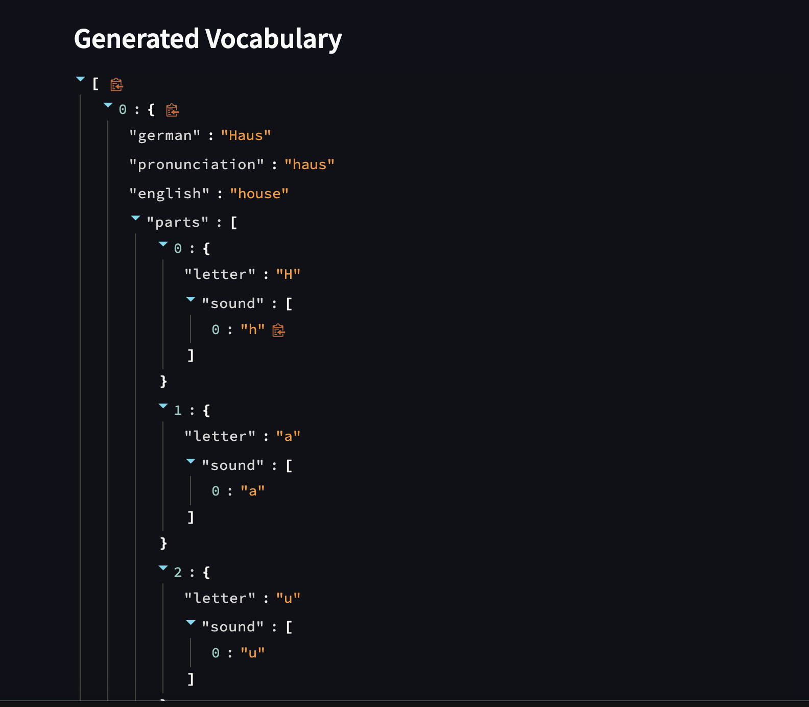

<h1 align="center">genAI Bootcamp 2025</h1>

## Introduction

This project uses AI to assist A1-level German learners by guiding sentence construction through hints, vocabulary, and structured feedback—without direct translations.

## Table of Contents

- [Introduction](#introduction)
- [Table of Contents](#table-of-contents)
- [Business](#business)
- [Backend](#backend)
- [Frontend](#frontend)
- [Opea](#opea-open-process-execution-agent)
- [Vocab Importer](#vocab-importer)
- [Technologies](#technologies)
  - [Programming Languages](#programming-languages)
  - [Applications, Plugins & Tools Used](#applications--plugins---tools-used)
- [Sentence Constructor AI Model Readme Files](#sentence-constructor-ai-model-readme-files)
- [Problems](#problems)
  - [Meta AI](#meta-ai)
  - [Frontend Integration with Backend](#frontend-integration-with-backend)
  - [Mega Service](#mega-service)
- [Acknowledgments](#acknowledgments)

[Generate TOC](https://ecotrust-canada.github.io/markdown-toc/)

 

## Business

The platform enhances language learning with personalized, AI-driven study activities, supporting real-time interactions and adaptive feedback. It must accommodate 100 active students in Berlin while ensuring data privacy and cost-effective infrastructure. A dedicated AI PC (€4,000–€7,000 budget) is planned to optimize performance.

Your role as an AI Engineer involves:

- Developing AI-driven learning applications.
- Maintaining and improving the learning portal.
- Expanding language support while balancing scalability and privacy.

## Backend

The backend is developed using Flask and serves as the core API for the platform. It handles study sessions, vocabulary management, and user interactions.

### Key Features:

- **Framework:** Flask with SQLAlchemy ORM.
- **Database:** SQLite for managing vocabulary and study session data.

### Technologies:

- **Flask-SQLAlchemy:** ORM for database interactions.
- **Flask-CORS:** Enables cross-origin requests from the frontend.
- **Unit Testing:** PyTest for API and database tests.

## Frontend

The frontend is built using React and connects directly to the backend APIs. It offers an intuitive interface where students interact with AI-driven exercises.

### Key Features:

- Real-time sentence construction guidance.
- Vocabulary tables with hints and structured sentence feedback.
- Interactive study sessions with progress tracking.

### Technologies:

- **React.js:** Core library for building the UI.
- **Axios:** For API requests to the Flask backend.
- **Styled-Components:** For styling React components.

## Opea (Open Process Execution Agent)

The OPEA module handles complex chat interaction workflows.

### Key Features:

- **OpenTelemetry Integration:** Exports logs and traces for better observability.

## Vocab Importer

The Vocab Importer is built with Streamlit and allows educators to upload and manage vocabulary lists.

### Features:

- Supports JSON uploads of vocabulary lists.
- Exports student-specific vocabulary for offline practice.
- Displays word lists.

## Technologies

### Programming Languages

- [XML](https://en.wikipedia.org/wiki/XML)
- [Python](https://www.python.org/)
- [JavaScript](https://de.wikipedia.org/wiki/JavaScript)
- [React](https://react.dev/)
- [TypeScript](https://www.typescriptlang.org/)

### Applications, Plugins & Tools Used

- **[GitHub](https://github.com/):** Essential for repository hosting, enabling code sharing, and project management.
- **[TinyPNG](https://tinypng.com/):** Used for compressing images and reducing file sizes without substantial quality loss.
- **[Gemini](https://gemini.google.com/):** Used for AI-powered language translation and sentence construction guidance, helping students learn German through structured vocabulary hints and contextual feedback.
- **[ChatGPT](https://chat.openai.com/):** Assisted in generating language learning exercises, evaluating sentence structures, and providing real-time grammar feedback for learners.
- **[Claude](https://claude.ai/):** Contributed to advanced text processing and interactive language learning, helping refine vocabulary usage and sentence formation.
- **[Windsurf](https://codeium.com/windsurf):** Used for backend deployment with Python Flask, enabling AI-driven interactions and ensuring seamless integration with language learning tools.
- **[Lovable](https://lovable.dev/):** Used for frontend development.
- **[Groq](https://groq.com/):** Provides accelerated AI inference for large language models.

## Sentence Constructor AI Model Readme Files

- [ChatGPT Readme](https://github.com/DavidTausend/gen-ai-bootcamp-2025/blob/main/sentence-constructor/chartgpt/readme.md)
- [Claude Readme](https://github.com/DavidTausend/gen-ai-bootcamp-2025/blob/main/sentence-constructor/claude/readme.md)
- [Gemini Readme](https://github.com/DavidTausend/gen-ai-bootcamp-2025/blob/main/sentence-constructor/gemini/readme.md)

## Problems

### Meta AI

I didn't use Meta AI for the project because it isn't launched yet in German, and there are delays due to data security laws within the EU.

### Frontend Integration with Backend

There are a couple of problems between the frontend and backend API integration that need to be corrected in the near future, including inconsistent API responses and CORS configuration issues.

### Mega Service

The Mega Service encountered issues related to API payload formatting, which led to 400 Bad Request errors. These were resolved by adjusting the JSON payload structure and improving error handling.

[Mega Service solution](/Users/davidtausend/Documents/lang-portal/genAI/gen-ai-bootcamp-2025/opea-comps/mega-service/Readme.md)

## Acknowledgments

- My Mentor, **Andrew Brown** — I want to thank him for his guidance and support throughout this journey, helping me deepen my understanding of GenAI.
